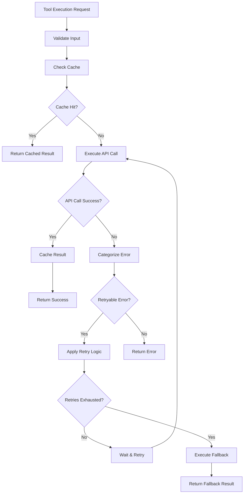

# Robust Error Handling Guide for AgentFlow SaaS Platform

## Overview

This guide explains the comprehensive error handling system implemented for the AgentFlow SaaS platform, designed to handle various types of errors that can occur when working with dynamic tools and external APIs.

## Problem Solved

The original issue was that tools (like the Gemini web search tool) were failing with 403 Forbidden errors, and the system lacked robust error handling for:

1. **API Authentication Failures** - Invalid or expired API keys
2. **Rate Limiting** - API rate limit exceeded
3. **Network Issues** - Connection timeouts, network failures
4. **Server Errors** - 5xx HTTP status codes
5. **Configuration Errors** - Invalid tool configurations
6. **Retry Logic** - No automatic retry for transient failures

## Solution Architecture

### 1. Enhanced Dynamic Tool Builder (`dynamic-tool-builder.ts`)

#### Key Improvements:

- **Robust API Call Handling**: Enhanced `executeApiCall` method with proper error categorization
- **Retry Mechanism**: Exponential backoff with configurable retry attempts
- **API Key Validation**: Comprehensive validation of authentication credentials
- **Security**: Sanitized logging to prevent API key exposure
- **Health Checks**: Built-in health monitoring for tools

#### Error Categories Handled:

```typescript
// Authentication & Authorization
- 401 Unauthorized: Invalid API key
- 403 Forbidden: Insufficient permissions

// Rate Limiting
- 429 Too Many Requests: Rate limit exceeded

// Network Issues
- Timeout errors
- Connection failures
- DNS resolution issues

// Server Errors
- 500 Internal Server Error
- 502 Bad Gateway
- 503 Service Unavailable

// Client Errors
- 400 Bad Request: Invalid parameters
- 404 Not Found: Resource not found
- 422 Unprocessable Entity: Validation failed
```

### 2. Comprehensive Error Handler (`error-handler.ts`)

#### Features:

- **Error Categorization**: Automatic classification of errors by type
- **Recovery Mechanisms**: Intelligent retry logic with fallback actions
- **User-Friendly Messages**: Clear error messages for end users
- **Metrics Collection**: Error tracking and analytics
- **Context Sanitization**: Secure logging without exposing sensitive data

#### Usage Example:

```typescript
import { withErrorHandling, createErrorContext } from '../utils/error-handler';

const result = await withErrorHandling(
  async () => {
    // Your operation here
    return await someApiCall();
  },
  createErrorContext('tool-id', 'agent-id', 'org-id'),
  {
    maxRetries: 3,
    retryDelay: 1000,
    exponentialBackoff: true,
    retryableErrors: ['network', 'timeout', 'server'],
    fallbackAction: async () => {
      // Fallback logic if retries fail
      return { message: 'Service temporarily unavailable' };
    }
  }
);
```

### 3. Health Check System

#### Individual Tool Health Check:

```typescript
// Check health of a specific tool
const healthResult = await toolBuilder.healthCheck('tool-id');

// Response:
{
  healthy: true,
  status: 'healthy',
  responseTime: 245,
  lastChecked: '2024-01-15T10:30:00Z'
}
```

#### Bulk Health Check:

```typescript
// Check health of all tools
const allHealthResults = await toolBuilder.healthCheckAll();

// Response:
{
  'tool-1': { healthy: true, status: 'healthy', responseTime: 245 },
  'tool-2': { healthy: false, status: 'unhealthy', error: '403 Forbidden' },
  // ... more tools
}
```

### 4. API Routes for Monitoring

#### Health Check Endpoints:

- `GET /agentflow/api/tools/:toolId/health` - Check specific tool health
- `GET /agentflow/api/tools/health` - Check all tools health with summary

#### Error Metrics Endpoints:

- `GET /agentflow/api/errors/metrics` - Get error statistics
- `GET /agentflow/api/errors/statistics` - Get error analytics

## Configuration Options

### Tool Configuration:

```typescript
const toolConfig: ToolConfig = {
  id: 'gemini-websearch-tool',
  name: 'Gemini Web Search',
  description: 'Search the web using Gemini API',
  apiEndpoint: 'https://generativelanguage.googleapis.com/v1beta/models/gemini-2.0-flash-exp:generateContent',
  method: 'POST',
  authentication: {
    type: 'api_key',
    config: {
      name: 'X-API-Key',
      value: 'your-api-key-here'
    }
  },
  timeout: 30000,        // 30 seconds
  retries: 3,            // 3 retry attempts
  cache: {
    enabled: true,
    ttl: 300             // 5 minutes cache
  },
  validation: {
    enabled: true
  }
};
```

### Error Recovery Options:

```typescript
const recoveryOptions: ErrorRecoveryOptions = {
  maxRetries: 3,                    // Maximum retry attempts
  retryDelay: 1000,                 // Base delay between retries (ms)
  exponentialBackoff: true,         // Use exponential backoff
  retryableErrors: [                // Custom retryable error patterns
    'network',
    'timeout',
    'server',
    'rate_limit'
  ],
  fallbackAction: async () => {     // Fallback action if all retries fail
    return { message: 'Service unavailable' };
  }
};
```

## Error Handling Flow



## Best Practices

### 1. API Key Management

- **Validation**: Always validate API keys before making requests
- **Security**: Never log API keys in plain text
- **Rotation**: Implement API key rotation mechanisms
- **Permissions**: Ensure API keys have minimal required permissions

### 2. Retry Strategy

- **Exponential Backoff**: Use exponential backoff to avoid overwhelming APIs
- **Jitter**: Add random jitter to prevent thundering herd problems
- **Circuit Breaker**: Implement circuit breaker pattern for failing services
- **Timeout**: Set appropriate timeouts for different operations

### 3. Monitoring

- **Health Checks**: Regular health checks for all tools
- **Metrics**: Collect error metrics and success rates
- **Alerting**: Set up alerts for critical errors
- **Dashboards**: Create dashboards for error monitoring

### 4. User Experience

- **Clear Messages**: Provide clear, actionable error messages
- **Graceful Degradation**: Implement fallback mechanisms
- **Progress Indicators**: Show progress for long-running operations
- **Recovery Actions**: Provide users with recovery options

## Troubleshooting Common Issues

### 1. 403 Forbidden Errors

**Cause**: Invalid API key or insufficient permissions

**Solution**:
```typescript
// Check API key configuration
const authConfig = toolConfig.authentication;
if (!authConfig?.config?.value) {
  throw new Error('API key not configured');
}

// Validate API key format
if (authConfig.config.value.length < 10) {
  throw new Error('API key seems too short');
}
```

### 2. Rate Limiting (429 Errors)

**Cause**: Too many requests to the API

**Solution**:
```typescript
// Implement rate limiting
const rateLimitConfig = {
  requestsPerMinute: 60,
  burstLimit: 10
};

// Use exponential backoff
const retryOptions = {
  maxRetries: 5,
  retryDelay: 1000,
  exponentialBackoff: true
};
```

### 3. Timeout Errors

**Cause**: API requests taking too long

**Solution**:
```typescript
// Set appropriate timeouts
const timeoutConfig = {
  connectionTimeout: 5000,    // 5 seconds
  requestTimeout: 30000,      // 30 seconds
  retryTimeout: 10000         // 10 seconds
};
```

### 4. Network Errors

**Cause**: Network connectivity issues

**Solution**:
```typescript
// Implement network error handling
const networkErrorHandler = {
  retryableErrors: ['ECONNRESET', 'ETIMEDOUT', 'ENOTFOUND'],
  maxRetries: 3,
  retryDelay: 2000
};
```

## Monitoring and Alerting

### Error Metrics

The system automatically collects the following metrics:

- **Error Count**: Total number of errors by type
- **Error Rate**: Errors per minute/hour
- **Recovery Rate**: Percentage of successful recoveries
- **Response Time**: Average response time for operations
- **Success Rate**: Percentage of successful operations

### Health Check Monitoring

```typescript
// Example health check monitoring
setInterval(async () => {
  const healthResults = await toolBuilder.healthCheckAll();
  const unhealthyTools = Object.entries(healthResults)
    .filter(([_, result]) => !result.healthy);
  
  if (unhealthyTools.length > 0) {
    logger.warn('Unhealthy tools detected', {
      unhealthyTools: unhealthyTools.map(([id, result]) => ({
        id,
        error: result.error
      }))
    });
  }
}, 60000); // Check every minute
```

## Conclusion

This robust error handling system provides:

1. **Reliability**: Automatic retry and recovery mechanisms
2. **Security**: Secure handling of sensitive information
3. **Monitoring**: Comprehensive error tracking and health checks
4. **User Experience**: Clear error messages and graceful degradation
5. **Scalability**: Designed to handle high-volume SaaS operations

The system is designed to be extensible and can be easily adapted for new types of tools and error scenarios as the platform grows.
